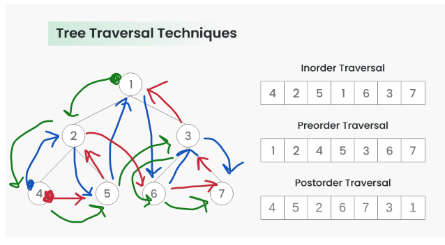

# InOrder Vs PreOrder Vs PostOrder




## (Blue) Inoder Traversal - Gives Nodes in decreasing order

Algorithm Inorder(tree)
1. Traverse the left subtree, i.e., call Inorder(left->subtree)
2. Visit the root.
3. Traverse the right subtree, i.e., call Inorder(right->subtree)

```java

void printInorder(Node node)
    {
        if (node == null)
            return;
 
        // First recur on left child
        printInorder(node.left);
 
        // Then print the data of node
        System.out.print(node.key + " ");
 
        // Now recur on right child
        printInorder(node.right);
    }


```


## (Green) Preorder Traversal - Create a copy of tree

Algorithm Preorder(tree)
1. Visit the root.
2. Traverse the left subtree, i.e., call Preorder(left->subtree)
3. Traverse the right subtree, i.e., call Preorder(right->subtree) 

```java
void printPreorder(Node node)
    {
        if (node == null)
            return;
 
        // First print data of node
        System.out.print(node.key + " ");
 
        // Then recur on left subtree
        printPreorder(node.left);
 
        // Now recur on right subtree
        printPreorder(node.right);
    }


```


## (Red) Postorder Traversal - Delete a tree

1. Traverse the left subtree, i.e., call Postorder(left->subtree)
2. Traverse the right subtree, i.e., call Postorder(right->subtree)
3. Visit the root

```java

void printPostorder(Node node)
    {
        if (node == null)
            return;
 
        // First recur on left subtree
        printPostorder(node.left);
 
        // Then recur on right subtree
        printPostorder(node.right);
 
        // Now deal with the node
        System.out.print(node.key + " ");
    }


```


## Resources

https://www.geeksforgeeks.org/tree-traversals-inorder-preorder-and-postorder/